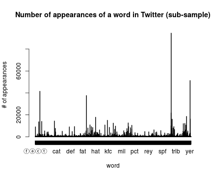
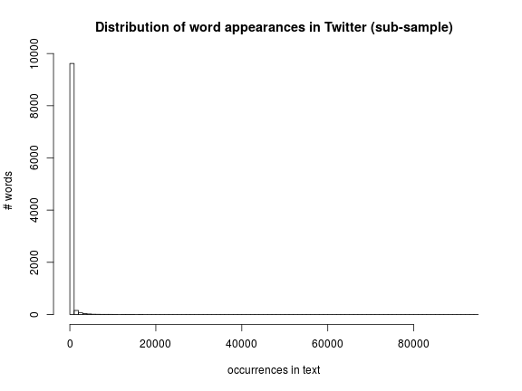
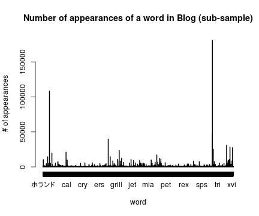
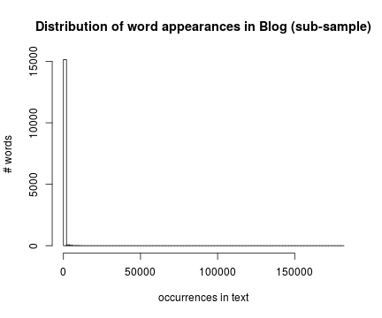
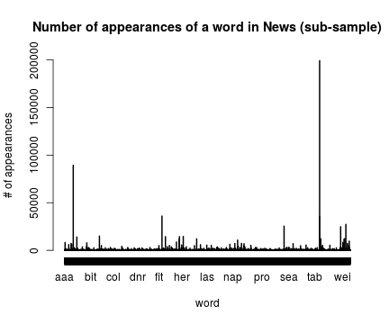
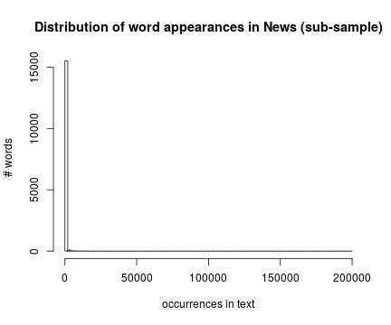

<!-- Instructions -->

<!-- The goal of this project is just to display that you've gotten used to working with the data and that you are on track to create your prediction algorithm. Please submit a report on R Pubs (http://rpubs.com/) that explains your exploratory analysis and your goals for the eventual app and algorithm. This document should be concise and explain only the major features of the data you have identified and briefly summarize your plans for creating the prediction algorithm and Shiny app in a way that would be understandable to a non-data scientist manager. You should make use of tables and plots to illustrate important summaries of the data set. The motivation for this project is to: 1. Demonstrate that you've downloaded the data and have successfully loaded it in.2. Create a basic report of summary statistics about the data sets.3. Report any interesting findings that you amassed so far.4. Get feedback on your plans for creating a prediction algorithm and Shiny app. -->
<!-- Review criteria -->

<!--     Does the link lead to an HTML page describing the exploratory analysis of the training data set? -->
<!--     Has the data scientist done basic summaries of the three files? Word counts, line counts and basic data tables? -->
<!--     Has the data scientist made basic plots, such as histograms to illustrate features of the data? -->
<!--     Was the report written in a brief, concise style, in a way that a non-data scientist manager could appreciate? -->


## Project goal

The goal of the project is to create a Shiny App that is able to help in the process of writing text by suggesting the user words that naturally would follow in the text he/she is composing.

## Algorithm and Model ideas

With the work done in this exploratory analysis, the idea is to extract from the corpus (i.e., a huge amount of written text) of a certain language the frequency of bigrams or trigrams (i.e., pairs or triplets of consecutive words in a text) and create a Markov model. With the Markov model it is possible to estimate the probability of a follow-up word once a word is written by the user, thus allowing to suggest one or more words to complete the text. The model will also be able to learn and update the Markov model when new bigrams/trigrams are observed (e.g., the user types new word combinations in the text) .

## Data set 

The data set is composed by three English text corpora: i) English Twitter posts, ii) US blog posts, iii) US news. These data is provided by the Swiftkey project partner.

## Data Basic Summary


The Twitter corpus is composed of 2360148 lines of text, while the Blog corpus contains 899288 lines, and the news contains 1010242 lines. Concerning the number of words (numbers have been removed from the text in the cleaning process) the sets have values of 32793654, 39121588, and 36721091 for Twitter, blog, and news dataset respectively.

The numbers are also summarized in the following data table:

| data set | # words | # lines | # punctuation signs | # numbers |
|----------|-----------------|-----------------|-----------------|-------------------|
|  Twitter |32793654|2360148|8296186|4744530|
|  Blog |39121588|899288|6638024|1859731|
|  News |36721091|1010242|7052199|2198691|


## Frequency of words distribution


In the written text it is hardly that people use all the words available in the language. First of all the grammar forces to have certain words more than others (e.g., the subject of the actions), second certain style conventions play also a role in the choice of words that are used (e.g., think about the legal environment), third certain people from certain social groups or region might tend to use more frequently terms that other groups do not use that often. It has been shown that in text, the distribution of frequency of terms tends to follow skewed distribution where most of the terms tend to appear very few times, but few terms appear many many times. Such distributions tend to follow power laws of Zipf's law distributions [1].  
In the samples under analysis I see a similar situation. The plots below represent the number of times a word appears in the text and the words frequency distribution (i.e., how many words appear a x-number of times). For each document corpus a random sample has been chosen equal to 10% of the original size of the corpus due to computational performance; given the high number of text lines it is sufficient to have a reasonable estimantion of the frequencies.









The most used terms (first 10 are shown) across the Twitter, Blog and News corpora (sampled) respectively are as follows: 

|   the|   you|   and|   for|  that|  with|  have|  your|  this|  just|
|-----:|-----:|-----:|-----:|-----:|-----:|-----:|-----:|-----:|-----:|
| 94481| 51243| 41450| 37567| 21732| 18529| 17794| 16205| 16035| 14985|


|    the|    and|  that|   for|   was|  with|   you|  this|  have|   but|
|------:|------:|-----:|-----:|-----:|-----:|-----:|-----:|-----:|-----:|
| 180598| 108121| 47294| 39450| 30742| 28233| 27424| 25445| 23431| 21084|


|    the|   and|   for|  that|  with|  said|   was|   but|   his|  from|
|------:|-----:|-----:|-----:|-----:|-----:|-----:|-----:|-----:|-----:|
| 199161| 89227| 35998| 35600| 27238| 25368| 24682| 14948| 14496| 14340|

The words reported in the table are quite consistent across the corpora and it sounds also reasonable that these are the most frequent in an English written text.


### References
[1] Casper Petersen, Jakob Grue Simonsen, and Christina Lioma. 2016. Power Law Distributions in Information Retrieval. ACM Trans. Inf. Syst. 34, 2, Article 8 (February 2016), 37 pages. DOI=http://dx.doi.org/10.1145/2816815 


### Appendix: R code used


```r
knitr::opts_chunk$set(echo = FALSE, warning = FALSE)
library(tm)
library(parallel)
cpus<-7

cl<-makeCluster(cpus)

contw<-file("../final/en_US/en_US.twitter.txt", "r") 
conbl<-file("../final/en_US/en_US.blogs.txt", "r") 
connw<-file("../final/en_US/en_US.news.txt", "r") 

linesTw<-readLines(contw)
linesBl<-readLines(conbl)
linesNw<-readLines(connw)

close(contw)
close(conbl)
close(connw)

#clusterEvalQ(cl, library("tm"))
#clusterExport(cl = cl, varlist = c("linesTW"), envir = environment())

allDocs<-list(linesTw, linesBl, linesNw)


numbersTw<-parSapply(cl,gregexpr("\\d+(.|,)\\d+",allDocs[[1]]),length)+1
numbersBl<-parSapply(cl,gregexpr("\\d+(.|,)\\d+",allDocs[[2]]),length)+1
numbersNw<-parSapply(cl,gregexpr("\\d+(.|,)\\d+",allDocs[[3]]),length)+1

totalNumTw<-sum(numbersTw)
totalNumBl<-sum(numbersBl)
totalNumNw<-sum(numbersNw)

clean<-parLapply(cl, allDocs, removeNumbers)

punctuationTw<-parSapply(cl,gregexpr("[[:punct:]]",clean[[1]]),length)
punctuationBl<-parSapply(cl,gregexpr("[[:punct:]]",clean[[2]]),length)
punctuationNw<-parSapply(cl,gregexpr("[[:punct:]]",clean[[3]]),length)


totalPunctTw<-sum(punctuationTw)
totalPunctBl<-sum(punctuationBl)
totalPunctNw<-sum(punctuationNw)


clean<-parLapply(cl, clean, removePunctuation)


wordsTw<-parSapply(cl,gregexpr("\\W+", allDocs[[1]]), length) + 1
wordsBl<-parSapply(cl,gregexpr("\\W+", allDocs[[2]]), length) + 1
wordsNw<-parSapply(cl,gregexpr("\\W+", allDocs[[3]]), length) + 1


stopCluster(cl)

totalWordsTw<-sum(wordsTw)
totalWordsBl<-sum(wordsBl)
totalWordsNw<-sum(wordsNw)

numberLinesTw<-length(linesTw)
numberLinesBl<-length(linesBl)
numberLinesNw<-length(linesNw)

options("scipen"=100, "digits"=4)


set.seed(10)

selectedTw<-rbinom(length(clean[[1]])/10,length(clean[[1]]),.5)
selectedBl<-rbinom(length(clean[[2]])/10,length(clean[[2]]),.5)
selectedNw<-rbinom(length(clean[[3]])/10,length(clean[[3]]),.5)

termsTw<-termFreq(clean[[1]][selectedTw])
termsBl<-termFreq(clean[[2]][selectedBl])
termsNw<-termFreq(clean[[3]][selectedNw])

plot(termsTw, main = "Number of appearances of a word in Twitter (sub-sample)", ylab = "# of appearances", xlab = "word") 
hist(termsTw, breaks = 100, main = "Distribution of word appearances in Twitter (sub-sample)", ylab = "# words ", xlab = "occurrences in text") 
plot(termsBl, main = "Number of appearances of a word in Blog (sub-sample)", ylab = "# of appearances", xlab = "word") 
hist(termsBl, breaks = 100, main = "Distribution of word appearances in Blog (sub-sample)", ylab = "# words ", xlab = "occurrences in text") 
plot(termsNw, main = "Number of appearances of a word in News (sub-sample)", ylab = "# of appearances", xlab = "word") 
hist(termsNw, breaks = 100, main = "Distribution of word appearances in News (sub-sample)", ylab = "# words ", xlab = "occurrences in text") 
kable(t(as.matrix(head(sort(termsTw,decreasing = T),10))), format = "markdown")
kable(t(as.matrix(head(sort(termsBl,decreasing = T),10))), format = "markdown")
kable(t(as.matrix(head(sort(termsNw,decreasing = T),10))), format = "markdown")
```
